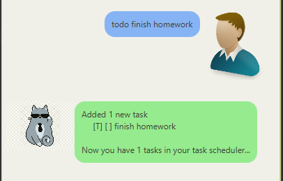
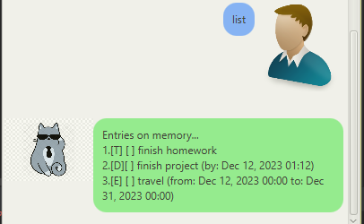
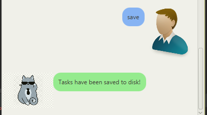

# User Guide
Tom is a lightweight application to schedule and manage tasks. It is very fast and efficient. Can be distributed as a tiny .jar file!

## Features

### Feature - Add ToDo
> #### todo 
A todo is a task that has a description, but no deadlines

**Usage** - `todo {task description}`

**For example:**

`todo finish homework`

**Expected Output:**

### Feature - Add deadlines
>#### deadline

A deadline is a task that has a description and a deadline.

**Usage** - `deadline {description/deadline}`

**For example:**

`deadline finish project/2023-12-12 01:12`

**Expected Output:**

### Feature - Add events
>#### event

An event is a task that has a description, from date and to date.

**Usage** - `event {description/from/to}`

**For example:**

`event travel/2023-12-12 00:00/2023-12-31 00:00`

**Expected Output:**

### Feature - Find tasks
>#### find

find function can index any task that may or may not contain the full keyword. It is flexible with inputs.

**Usage** - `find {description}`

**For example:**

`find travel` or `find tra` 

**Expected Output:**

### Feature - list tasks
>#### list

list function prints out all the tasks on memory.

**Usage** - `list`

**For example:**

`list`

**Expected Output:**

### Feature - Delete tasks
>#### delete

delete function can delete any task based on the item number.

**Usage** - `delete {item number}`

**For example:**

`delete 1`

**Expected Output:**

### Feature - mark tasks
>#### mark

mark function can mark any task (with an X) based on the item number.
Tasks that are already marked, cannot be marked again.

**Usage** - `mark {item number}`

**For example:**

`mark 1`

**Expected Output:**

### Feature - unmark tasks
>#### unmark

unmark function can mark any task (with an X) based on the item number.
Tasks that are already unmarked, cannot be unmarked again.

**Usage** - `unmark {item number}`

**For example:**

`unmark 1`

**Expected Output:**

### Feature - save tasks
>#### save

save function can save all the actions committed since application opening.

**Usage** - `save`

**For example:**

`save`

**Expected Output:**

